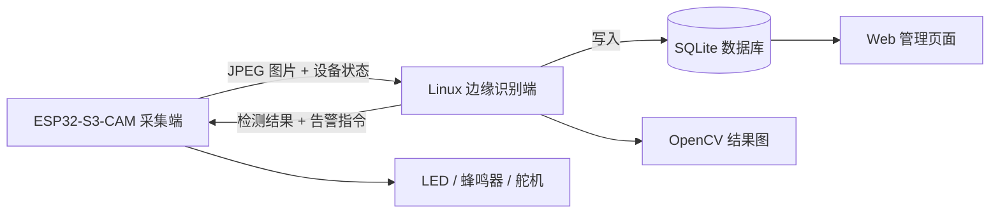
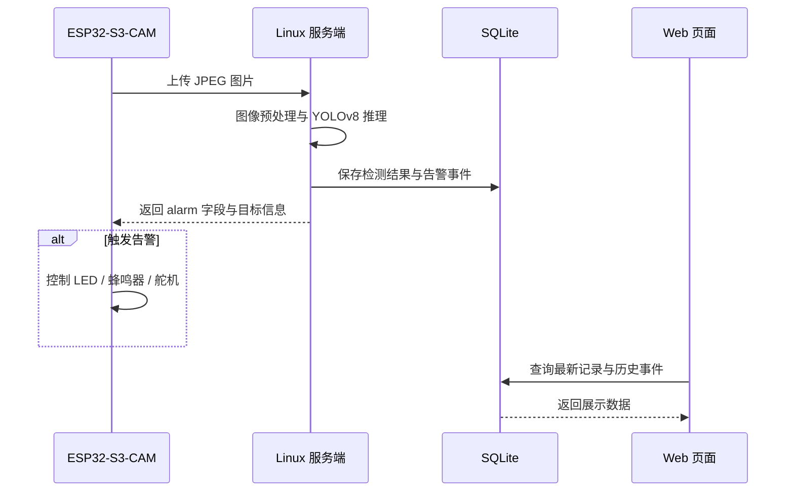
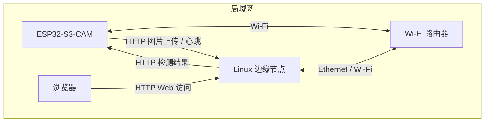

# 基于 ESP32-S3-CAM 与 YOLOv8 的边缘视觉安全告警系统开发文档

## 1. 项目概述

本项目面向实验室、工位、小型设备区域等安全监测场景，设计并实现一套低成本的边缘视觉安全告警系统。系统以 ESP32-S3-CAM 作为图像采集终端，Linux 端作为边缘计算节点，通过 YOLOv8 对采集图像进行目标检测，并结合本地告警外设、SQLite 数据存储和 Web 管理页面，实现图像采集、目标识别、安全告警、事件记录和历史查询的完整闭环。

项目重点突出嵌入式 Linux 应用开发、物联网终端开发和边缘 AI 视觉检测能力。ESP32 端负责摄像头采集、Wi-Fi 联网、HTTP 通信、FreeRTOS 任务调度和 GPIO 外设联动；Linux 端负责图像接收、YOLOv8 推理、OpenCV 结果处理、SQLite 记录保存和 Web 页面展示。

## 2. 项目背景

在实验室、机房、仓储和小型设备区域中，常见安全问题包括人员误入危险区域、异常物品出现、设备区域无人值守、火焰或烟雾等异常情况。传统监控系统通常只提供视频查看功能，缺少本地智能分析、自动告警和事件记录能力。

随着 AIoT 和边缘计算的发展，越来越多的嵌入式设备开始承担图像采集、数据上报和本地联动控制任务，而较复杂的视觉推理则由 Linux 边缘节点完成。本项目采用“ESP32-S3-CAM 终端采集 + Linux YOLOv8 边缘识别”的端边协同架构，在降低硬件复杂度的同时，实现具备真实应用场景的安全告警系统。

## 3. 项目目标

- 使用 ESP32-S3-CAM 完成图像采集、Wi-Fi 联网和图片上传。
- 使用 Linux 端搭建图像接收、目标检测、告警规则判断和数据管理服务。
- 使用 Ultralytics YOLOv8 完成人员、危险物品或异常目标检测。
- 使用 OpenCV 完成图像读取、检测框绘制和结果图片保存。
- 使用 SQLite 保存告警记录、设备状态、截图路径和检测结果。
- 实现 ESP32 端 LED、蜂鸣器或舵机告警联动。
- 实现轻量 HTML Web 管理页面，用于查看检测结果和历史告警。
- 形成可演示、可复现、可维护的端边协同嵌入式课程设计项目。

## 4. 应用场景

本项目可应用于以下场景：

- 实验室危险区域人员闯入检测。
- 工位或设备区域异常占用检测。
- 小型机房、仓储区域安全监测。
- 火焰、烟雾等异常目标检测。
- 特定物品出现后的自动告警与事件记录。

课程设计阶段可以先选定一个具体场景，例如“实验室安全区域监测”。当系统检测到人员进入指定区域，或者检测到火焰、烟雾等异常目标时，自动触发本地告警，并保存检测图片和告警记录。

## 5. 系统范围与约束

### 5.1 系统范围

本项目实现 ESP32-S3-CAM 图像采集终端、Linux 边缘识别服务、SQLite 本地数据存储和 Web 管理页面的基础闭环。系统以局域网部署为主，重点验证端边协同、图片上传、YOLOv8 检测、告警联动和历史事件查询能力。

系统包含以下内容：

- ESP32-S3-CAM 采集 JPEG 图片并通过 HTTP 上传到 Linux 服务端。
- Linux 服务端接收图片，调用 YOLOv8 完成目标检测。
- 系统根据检测类别、置信度和连续触发次数判断是否产生告警。
- ESP32 根据服务端返回结果控制 LED、蜂鸣器或舵机执行本地告警。
- SQLite 保存设备状态、检测记录、目标结果和告警事件。
- Web 页面展示最新检测结果、历史告警记录、设备在线状态和告警处理状态。

系统暂不包含以下内容：

- 不实现完整的视频流平台，仅支持周期性图片采集和上传。
- 不实现公网访问和云端平台接入。
- 不实现复杂用户权限体系，课程设计阶段仅保留本地管理页面。
- 不承担大规模模型训练流程，初期使用 YOLOv8n 预训练模型或已有自定义模型权重。
- 不保证工业安全认证等级，告警结果仅用于课程设计演示和原型验证。

### 5.2 功能需求

| 编号 | 功能项 | 需求说明 |
| --- | --- | --- |
| FR-01 | 图像采集 | ESP32-S3-CAM 按设定周期采集 JPEG 图片。 |
| FR-02 | 图片上传 | ESP32 通过 HTTP POST 将图片、设备 ID 和运行状态上传到 Linux 服务端。 |
| FR-03 | 目标检测 | Linux 服务端调用 YOLOv8 对图片进行目标检测，输出类别、置信度和坐标框。 |
| FR-04 | 告警判断 | 系统根据检测结果、置信度阈值和连续触发规则判断是否告警。 |
| FR-05 | 本地联动 | ESP32 根据服务端返回结果控制 LED、蜂鸣器或舵机。 |
| FR-06 | 数据存储 | SQLite 保存检测记录、告警事件、目标结果和设备状态。 |
| FR-07 | Web 展示 | Web 页面支持查看最新检测图、历史告警、告警截图和设备在线状态。 |
| FR-08 | 告警处理 | Web 页面支持将告警事件标记为已处理。 |

### 5.3 非功能需求

| 编号 | 指标项 | 目标要求 |
| --- | --- | --- |
| NFR-01 | 上传周期 | 默认 3 秒上传 1 张图片，支持通过配置调整。 |
| NFR-02 | 图片分辨率 | 默认使用 640x480 或更低分辨率，优先保证稳定上传和推理速度。 |
| NFR-03 | 单次检测延迟 | 从服务端收到图片到返回检测结果，目标不超过 2 秒。 |
| NFR-04 | 告警响应延迟 | 从服务端判定告警到 ESP32 外设响应，目标不超过 3 秒。 |
| NFR-05 | 稳定性 | 系统应支持连续运行 2 小时以上无异常退出。 |
| NFR-06 | 可维护性 | 关键参数通过配置文件或宏定义管理，避免硬编码在业务逻辑中。 |
| NFR-07 | 可追溯性 | 每条告警事件应能关联原始图片、结果图片、检测目标和设备 ID。 |
| NFR-08 | 异常恢复 | 网络异常、服务端异常或数据库写入异常时应有日志记录和重试策略。 |

### 5.4 关键约束

- ESP32-S3-CAM 端内存有限，采集分辨率、JPEG 质量和上传频率需要根据实际运行情况调整。
- 课程设计阶段优先使用局域网 HTTP 通信，后续可扩展 HTTPS 或 Token 鉴权。
- Linux 端运行环境可使用 WSL2、Ubuntu 虚拟机或实体 Linux 主机，但需保证 ESP32 能访问服务端 IP 和端口。
- YOLOv8 推理性能受 CPU/GPU、模型大小和图片分辨率影响，初期建议使用 YOLOv8n。
- 火焰、烟雾和危险物品检测若使用非 COCO 类别，需要准备自定义模型权重或替换检测模型。

## 6. 系统总体架构

系统主要分为四个部分：

### 6.1 ESP32 图像采集端

ESP32-S3-CAM 负责摄像头初始化、图像采集、Wi-Fi 连接、HTTP 图片上传、设备状态上报和 GPIO 告警控制。

主要职责：

- 初始化 OV3660 摄像头。
- 周期性采集 JPEG 图像。
- 连接局域网 Wi-Fi。
- 通过 HTTP Client 将图片上传到 Linux 端。
- 通过 HTTP Server 或轮询接口接收告警控制指令。
- 使用 GPIO 控制 LED、蜂鸣器或舵机。
- 使用 FreeRTOS 拆分采集、上传、心跳和告警控制任务。

### 6.2 Linux 边缘识别端

Linux 端运行在 WSL2 环境中，负责接收 ESP32 上传的图像，并调用 YOLOv8 模型完成目标检测。

主要职责：

- 提供图片上传接口。
- 调用 YOLOv8 模型完成目标检测。
- 使用 OpenCV 绘制检测框并保存结果图片。
- 根据检测类别和置信度判断是否触发告警。
- 将检测结果写入 SQLite。
- 向 ESP32 返回检测结果或告警控制指令。

### 6.3 数据管理端

数据管理模块使用 SQLite 保存系统运行过程中的关键数据。

主要保存内容：

- 设备 ID。
- 检测时间。
- 检测目标类别。
- 检测置信度。
- 原始图片路径。
- 结果图片路径。
- 是否触发告警。
- 告警处理状态。
- 设备在线状态。

### 6.4 Web 管理端

Web 管理端使用 HTML 页面展示系统状态和检测记录。

主要功能：

- 查看最新检测图片。
- 查看 YOLOv8 检测结果。
- 查看历史告警记录。
- 查看告警截图。
- 查看设备在线状态。
- 按时间或类别筛选告警记录。

### 6.5 系统数据流

系统核心数据流如下：

1. ESP32-S3-CAM 完成图像采集并生成 JPEG 数据。
2. ESP32 通过 HTTP 上传图片及设备状态到 Linux 服务端。
3. Linux 服务端接收图片后执行预处理、YOLOv8 推理和告警规则判断。
4. Linux 服务端保存原始图、结果图、检测结果和告警事件到 SQLite。
5. Linux 服务端返回检测结果和告警指令。
6. ESP32 根据返回结果控制本地外设，并周期性上报心跳状态。
7. Web 页面读取数据库中的最新记录并展示检测结果、历史告警和设备状态。



### 6.6 告警处理时序

告警处理流程建议按以下时序执行：



### 6.7 模块职责边界

| 模块 | 输入 | 输出 | 主要职责 | 不承担职责 |
| --- | --- | --- | --- | --- |
| ESP32 图像采集端 | 摄像头图像、服务端配置、告警返回结果 | JPEG 图片、设备心跳、外设动作 | 图像采集、网络连接、图片上传、心跳上报、本地告警执行 | 不执行 YOLOv8 推理，不保存完整历史记录 |
| Linux 接口服务 | HTTP 请求、上传图片、心跳数据 | HTTP 响应、检测结果、告警指令 | 请求接收、参数校验、文件保存、业务流程编排 | 不直接操作 GPIO 外设 |
| YOLOv8 检测模块 | 原始图片路径或图像数据 | 目标类别、置信度、坐标框 | 模型加载、目标检测、结果格式化 | 不决定业务告警状态 |
| 告警规则模块 | 检测结果、阈值配置、历史触发状态 | 告警等级、告警状态、告警动作 | 判断是否告警、降低误报、控制告警抑制 | 不负责图像推理和数据库底层读写 |
| 数据管理模块 | 检测记录、告警事件、设备状态 | 查询结果、统计结果 | SQLite 表管理、数据写入、历史查询 | 不处理 HTTP 请求 |
| Web 管理页面 | 用户浏览请求、查询条件 | 页面数据、状态更新请求 | 展示检测结果、历史告警和设备状态 | 不执行模型推理 |

### 6.8 部署拓扑

课程设计阶段采用局域网部署，ESP32 与 Linux 服务端连接到同一 Wi-Fi 或同一局域网。ESP32 需要配置 Linux 服务端 IP 地址和端口，Linux 服务端监听固定端口对外提供 HTTP API 和 Web 页面。



部署约束如下：

- ESP32 与 Linux 服务端必须处于网络可达状态，ESP32 固件中配置的服务端地址应与实际运行地址一致。
- 如果 Linux 服务运行在 WSL2 中，需要确认 Windows 防火墙、WSL2 网络映射和局域网访问权限。
- Web 页面默认仅供局域网访问，不建议直接暴露到公网。
- 图片和 SQLite 数据库保存在 Linux 服务端本地磁盘，需预留足够存储空间。

### 6.9 边界与职责定义

为保证双端协同开发过程中的边界清晰，系统需要明确以下职责划分：

| 边界类型 | 说明 |
| --- | --- |
| 系统边界 | 本项目仅实现 ESP32 图像采集、Linux 目标检测、告警联动、数据存储和 Web 展示，不实现云端平台和公网分发。 |
| 设备边界 | ESP32 负责采集、上传、心跳和本地外设联动；Linux 负责检测、规则判断、数据库写入和页面展示。 |
| 数据边界 | 原始图片、结果图片、数据库和日志均由 Linux 统一管理，ESP32 不保存完整历史数据。 |
| 接口边界 | 双端通过约定好的 HTTP 接口通信，接口契约优先于具体实现，字段变更需同步更新文档。 |
| 部署边界 | Linux 服务可运行在 WSL2、Ubuntu 或实体 Linux 主机；ESP32 固件独立烧录与运行，但统一纳入同一仓库管理。 |
| 配置边界 | Wi-Fi、服务端地址、阈值、模型路径和鉴权参数分别由各自端配置文件或宏定义管理，不跨端硬编码。 |

边界管理要求：

- 不允许 ESP32 端直接访问数据库文件。
- 不允许 Linux 服务端直接操作 ESP32 的驱动实现。
- 不允许将业务逻辑写入通用工具目录。
- 不允许接口字段、错误码和状态定义在代码中随意漂移。
- 不允许把运行数据和模型文件作为源代码提交到版本库。

## 7. 技术栈

### 7.1 ESP32 端

- ESP32-S3-CAM：作为边缘图像采集终端。
- OV3660 摄像头：完成图像采集与 JPEG 图像输出。
- VS Code + ESP-IDF 插件：作为 ESP32 固件开发环境。
- Wi-Fi：实现设备接入局域网。
- HTTP Client / HTTP Server：完成图像上传、检测结果接收和设备控制接口。
- GPIO：控制 LED、蜂鸣器、舵机等告警外设。
- FreeRTOS 任务：实现采集、上传、心跳、告警控制等任务拆分。
- LED / 蜂鸣器 / 舵机联动：实现异常目标检测后的本地响应。

### 7.2 Linux 端

- WSL2：作为 Linux 开发与运行环境。
- Python 3：作为服务端主要开发语言。
- FastAPI：搭建图像接收、检测推理和管理接口。
- Ultralytics YOLOv8：完成目标检测。
- OpenCV：完成图像读取、预处理、绘制检测框和结果图片保存。
- SQLite：保存告警记录、设备状态、截图路径和检测结果。
- HTML：实现轻量 Web 管理页面。
- Git：进行版本管理。

### 7.3 语言与实现约束

本项目采用双语言复合开发模式，以便兼顾嵌入式端稳定性和 Linux 应用层开发效率。

| 端 | 语言 | 说明 |
| --- | --- | --- |
| ESP32-S3-CAM | C | 基于 ESP-IDF 开发，负责摄像头、Wi-Fi、HTTP 通信、FreeRTOS 任务和 GPIO 控制。 |
| Linux 服务端 | Python | 基于 FastAPI、OpenCV、Ultralytics YOLOv8 和 SQLite 开发服务端检测与管理逻辑。 |

约束要求：

- ESP32 端核心代码使用 C 开发，不以 C++ 作为主语言。
- Linux 服务端业务代码使用 Python 开发，保证接口、推理和数据处理的实现效率。
- C++ 不作为本项目主语言，仅在后续确有必要时用于局部扩展或性能优化，不作为当前课程设计要求。
- 双端通过 HTTP 接口协同，不依赖额外的跨语言中间层。
- 代码实现应与文档中的模块边界保持一致，不允许跨端混写业务逻辑。

## 8. 核心功能设计

### 8.1 图像采集与上传

ESP32-S3-CAM 通过 OV3660 摄像头采集 JPEG 图像，并通过 HTTP POST 上传到 Linux 端。

上传内容包括：

- device_id：设备编号。
- image：JPEG 图片数据。
- rssi：Wi-Fi 信号强度，可选。
- free_heap：剩余堆内存，可选。

图像采集策略：

- 默认采集分辨率设置为 VGA 640x480。如出现内存不足或上传超时，可降级为 QVGA 320x240。
- JPEG 压缩质量建议设置在 10 到 15 之间，优先保证上传稳定性。
- 采集周期默认 3 秒，后续可根据推理耗时和网络质量调整。
- 每次上传前应检查 Wi-Fi 连接状态，未联网时不执行图片上传。
- 上传失败时不阻塞摄像头任务，应记录失败次数并进入重试流程。

### 8.2 ESP32 硬件接口设计

ESP32-S3-CAM 端硬件由摄像头、状态指示灯、蜂鸣器和可选舵机构成。课程设计阶段建议先完成摄像头、LED 和蜂鸣器闭环，舵机作为扩展联动外设。

硬件连接建议如下：

| 外设 | 作用 | 连接方式 | 设计说明 |
| --- | --- | --- | --- |
| OV3660 摄像头 | 图像采集 | 使用开发板摄像头接口 | 使用开发板默认摄像头引脚配置，避免自行更改 DVP 引脚。 |
| 状态 LED | 运行状态和告警提示 | GPIO 输出 | 常亮表示联网成功，闪烁表示告警。 |
| 有源蜂鸣器 | 声音告警 | GPIO 输出，必要时增加三极管驱动 | 不建议直接驱动大电流蜂鸣器。 |
| 舵机 | 模拟门禁或机械动作 | PWM 输出，独立 5V 供电 | ESP32 与舵机电源需共地，避免舵机电流影响主板稳定性。 |

GPIO 分配需以实际 ESP32-S3-CAM 开发板原理图为准，避免占用摄像头、PSRAM、下载串口或启动相关引脚。示例分配如下：

| 信号 | 示例 GPIO | 方向 | 说明 |
| --- | --- | --- | --- |
| ALARM_LED | GPIO 2 | 输出 | 告警灯或状态灯。 |
| BUZZER | GPIO 4 | 输出 | 控制有源蜂鸣器。 |
| SERVO_PWM | GPIO 5 | 输出 | 舵机 PWM 控制，可选。 |

### 8.3 ESP32 固件任务设计

ESP32 固件采用 FreeRTOS 多任务方式实现，各任务之间通过队列、事件组或全局状态进行协作。固件应避免在同一个任务中同时完成摄像头采集、网络上传和外设控制，防止单个阻塞操作影响整体稳定性。

任务设计如下：

| 任务名称 | 职责 | 建议周期/触发方式 | 优先级建议 | 关键资源 |
| --- | --- | --- | --- | --- |
| wifi_task | Wi-Fi 初始化、断线重连、网络状态维护 | 事件触发 + 周期检查 | 高 | Wi-Fi 事件组 |
| camera_task | 摄像头初始化、图片采集、帧缓冲管理 | 默认 3 秒一次 | 中 | camera_fb_t |
| upload_task | HTTP 图片上传、解析服务端返回结果 | 收到图片后触发 | 中 | HTTP Client、上传队列 |
| heartbeat_task | 上报 RSSI、free_heap、在线状态 | 默认 10 秒一次 | 低 | 设备状态结构体 |
| alarm_task | LED、蜂鸣器、舵机联动控制 | 告警事件触发 | 中 | GPIO、PWM |
| watchdog_task | 监控关键任务状态 | 默认 5 秒一次 | 低 | 任务心跳时间戳 |

任务协作流程：

1. `wifi_task` 连接 Wi-Fi，连接成功后设置网络就绪标志。
2. `camera_task` 判断网络就绪后采集图片，并将图片指针或图片数据放入上传队列。
3. `upload_task` 从队列取出图片，上传到 Linux 服务端，并解析返回的 `alarm`、`targets` 和 `message` 字段。
4. 如果返回 `alarm=true`，`upload_task` 向 `alarm_task` 发送告警事件。
5. `alarm_task` 根据告警模式控制 LED、蜂鸣器或舵机，执行完成后恢复默认状态。
6. `heartbeat_task` 周期性上报设备状态，服务端根据最后心跳时间判断设备在线状态。

### 8.4 ESP32 资源与异常处理

ESP32 端需要重点关注内存、网络和外设稳定性。

资源控制要求：

- 每次图片上传完成后必须释放摄像头帧缓冲，避免内存泄漏。
- 上传队列长度建议设置为 1 或 2，避免网络阻塞时堆积大量图片。
- 通过 `esp_get_free_heap_size()` 周期性记录剩余堆内存。
- 摄像头初始化失败时应记录错误并延迟重试，不应频繁重启。
- 舵机等大电流外设建议使用独立供电，避免 ESP32 复位。

异常处理策略：

| 异常场景 | 处理策略 |
| --- | --- |
| Wi-Fi 连接失败 | 按固定间隔重试连接，连续失败时进入离线状态并停止上传。 |
| 服务端不可达 | 上传任务记录失败次数，延迟重试，不影响心跳任务运行。 |
| 摄像头采集失败 | 释放已有帧缓冲，重新初始化摄像头，必要时降低分辨率。 |
| HTTP 返回异常 | 丢弃本次检测结果，保持设备正常运行，并在下一周期继续上传。 |
| 内存不足 | 降低分辨率或延长上传周期，同时上报 free_heap 便于排查。 |
| 外设控制失败 | 记录错误状态，避免反复触发导致设备异常。 |

### 8.5 YOLOv8 目标检测

Linux 端接收到图片后，先完成文件校验、图像解码和基础预处理，再调用 Ultralytics YOLOv8 模型进行推理，得到目标类别、置信度和坐标框。

初期可以使用 YOLOv8n 预训练模型检测 person 等常见类别。后续可以根据项目需要扩展火焰、烟雾或危险物品检测模型。检测模块应输出统一结果结构，供告警规则、数据库存储和 Web 页面复用。

### 8.6 告警规则判断

系统根据检测结果判断是否触发告警。

示例规则：

- 检测到 person 且置信度超过设定阈值时，触发人员闯入告警。
- 检测到 fire 或 smoke 时，触发高优先级安全告警。
- 连续多次检测到异常目标时才触发告警，降低误报率。
- 未检测到异常目标时，只保存普通检测记录或不保存图片。

告警规则建议采用配置化方式管理，至少包含以下参数：

- 目标类别白名单或黑名单。
- 类别对应置信度阈值。
- 连续触发次数阈值。
- 告警抑制时间。
- 告警持续时长。
- 告警等级映射关系。

告警状态建议至少分为：`normal`、`suspected`、`alarm`、`handled` 四种状态，便于后续追踪事件生命周期。

### 8.7 ESP32 外设联动

当 Linux 端判断需要告警时，系统通过 HTTP 接口通知 ESP32 端执行本地联动。

可执行动作：

- LED 闪烁。
- 蜂鸣器响。
- 舵机转动，模拟门禁、挡板或机械执行结构。

联动动作应支持模式参数，例如 `beep_led`、`led_only`、`servo_open`，并支持持续时间配置。

### 8.8 数据存储

SQLite 用于保存告警事件、设备状态、检测目标和业务处理状态，方便后续查询、统计和展示。数据层应采用持久化 + DAO/Repository 封装的方式实现，业务层不直接拼接 SQL。

告警事件表设计示例：

```sql
CREATE TABLE alarm_events (
    id INTEGER PRIMARY KEY AUTOINCREMENT,
    device_id TEXT NOT NULL,
    event_type TEXT NOT NULL,
    alarm_level TEXT NOT NULL,
    target_class TEXT NOT NULL,
    confidence REAL,
    raw_image_path TEXT,
    result_image_path TEXT,
    alarm_status TEXT NOT NULL DEFAULT 'alarm',
    created_at TEXT NOT NULL,
    handled INTEGER DEFAULT 0,
    handled_at TEXT
);
```

设备状态表设计示例：

```sql
CREATE TABLE device_status (
    id INTEGER PRIMARY KEY AUTOINCREMENT,
    device_id TEXT NOT NULL,
    rssi INTEGER,
    free_heap INTEGER,
    status TEXT,
    updated_at TEXT NOT NULL
);
```

建议补充 `detection_targets` 明细表，用于记录单张图片中的多目标检测结果，避免一条告警事件只能保存一个目标类别：

```sql
CREATE TABLE detection_targets (
    id INTEGER PRIMARY KEY AUTOINCREMENT,
    event_id INTEGER NOT NULL,
    target_class TEXT NOT NULL,
    confidence REAL,
    box_x1 INTEGER,
    box_y1 INTEGER,
    box_x2 INTEGER,
    box_y2 INTEGER,
    FOREIGN KEY(event_id) REFERENCES alarm_events(id)
);
```

#### 8.8.1 数据持久化流程

系统的数据持久化流程建议如下：

1. ESP32 上传原始 JPEG 图片。
2. Linux 服务端先将原始图片保存到本地磁盘。
3. YOLOv8 完成目标检测后生成结果图片。
4. 检测结果、告警状态和设备状态写入 SQLite。
5. 若触发告警，更新告警事件状态并保存处理标记。
6. Web 页面通过查询接口读取数据库数据并展示。

该流程中，图片文件和数据库记录必须建立关联，确保告警事件可追溯。

#### 8.8.2 DAO / Repository 封装

数据访问层应通过 DAO 或 Repository 模块统一处理数据库读写，避免业务层直接操作 SQL 语句。

建议的 Repository 划分如下：

| 模块 | 职责 |
| --- | --- |
| `alarm_repository` | 告警事件新增、查询、状态更新。 |
| `device_repository` | 设备状态写入、最近在线时间更新、设备查询。 |
| `target_repository` | 多目标检测明细写入和查询。 |
| `system_repository` | 必要时维护系统日志或初始化数据。 |

Repository 设计原则：

- 只负责数据访问，不负责业务判断。
- 统一封装 CRUD 操作，避免多处重复 SQL。
- 参数化查询，避免 SQL 注入和字符串拼接。
- 返回结构尽量标准化，便于业务层处理。
- 数据库连接和事务管理集中处理，避免分散到多个业务函数中。

#### 8.8.3 数据一致性要求

数据持久化时应保证以下一致性：

- 原始图片保存成功后，再写数据库记录。
- 结果图片生成失败时，应明确记录异常，不得写入伪造结果。
- 告警事件与检测目标明细必须通过 `event_id` 关联。
- 设备状态更新应与心跳上报时间一致。
- 处理状态更新后，Web 页面应能立即查询到最新状态。

#### 8.8.4 异常处理要求

数据层常见异常及处理策略如下：

| 异常场景 | 处理策略 |
| --- | --- |
| 数据库文件不存在 | 启动时初始化数据库和表结构。 |
| 数据库写入失败 | 记录错误日志，返回明确错误码，不继续伪造成功结果。 |
| 图片路径写入失败 | 保留原始异常信息并回滚关联记录。 |
| 查询条件非法 | 在接口层直接拦截，不进入 Repository。 |
| 事务写入失败 | 必要时回滚当前事务，避免半写入状态。 |

#### 8.8.5 数据保留策略

课程设计阶段数据量较小，但仍应明确保留策略：

- 原始图片和结果图片保留最近一段时间的数据，避免磁盘无限增长。
- SQLite 数据库定期备份，防止意外丢失。
- 告警记录和设备状态默认长期保留，可根据课程设计需要增加清理策略。
- 日志文件按大小或日期轮转，避免单文件过大。

### 8.9 Web 管理页面

Web 页面用于展示系统检测结果和告警记录。

页面功能：

- 显示最新检测图片。
- 显示检测类别、置信度和告警状态。
- 显示历史告警列表。
- 支持查看告警截图。
- 支持将告警标记为已处理。
- 显示 ESP32 设备在线状态。

## 9. 接口设计

### 9.1 ESP32 上传图片接口

**接口名称**：图片上传与检测触发接口

**接口用途**：ESP32-S3-CAM 通过该接口向 Linux 服务端上传 JPEG 图片，并同步设备运行状态，由服务端完成目标检测、告警判断和结果返回。

**请求方法**：`POST`

**请求路径**：`/api/upload`

**请求头**

| 请求头 | 必填 | 说明 |
| --- | --- | --- |
| `Content-Type` | 是 | 固定为 `multipart/form-data`。 |
| `X-API-Token` | 否 | 接口访问令牌，课程设计阶段可选用。 |

**请求字段**

| 字段 | 类型 | 必填 | 说明 |
| --- | --- | --- | --- |
| `device_id` | string | 是 | 设备唯一编号，例如 `esp32_s3_cam_001`。 |
| `image` | file | 是 | JPEG 图片文件。 |
| `rssi` | int | 否 | Wi-Fi 信号强度，单位 dBm。 |
| `free_heap` | int | 否 | ESP32 当前剩余堆内存，单位字节。 |
| `capture_time` | string | 否 | 图片采集时间，建议使用 ISO 8601 格式。 |

**请求约束**

- 图片格式必须为 JPEG。
- 单张图片大小建议不超过 1 MB。
- `device_id` 必填且应唯一标识设备。
- 可选字段 `rssi`、`free_heap` 用于运行状态分析。
- 同一设备可连续上传多张图片，但服务端应按时间顺序处理。
- 请求超时时间建议控制在 5 秒以内。

**响应字段**

| 字段 | 类型 | 说明 |
| --- | --- | --- |
| `code` | int | 返回码，`0` 表示成功。 |
| `message` | string | 返回说明或错误信息。 |
| `alarm` | bool | 是否触发告警。 |
| `alarm_level` | string | 告警等级，如 `normal`、`low`、`medium`、`high`。 |
| `alarm_action` | string | 建议执行的联动动作，如 `beep_led`。 |
| `targets` | array | 检测目标列表。 |
| `event_id` | int | 告警事件 ID，便于数据库追踪。 |

**`targets` 子字段**

| 字段 | 类型 | 说明 |
| --- | --- | --- |
| `class` | string | 目标类别，如 `person`。 |
| `confidence` | float | 置信度。 |
| `box` | array[int] | 检测框坐标 `[x1, y1, x2, y2]`。 |

**错误码**

| 错误码 | 含义 |
| --- | --- |
| `0` | 成功。 |
| `4001` | 请求参数错误。 |
| `4002` | 图片格式错误。 |
| `4003` | 图片大小超限。 |
| `4004` | 设备未注册。 |
| `5001` | 模型推理失败。 |
| `5002` | 数据库写入失败。 |
| `5003` | 图片保存失败。 |
| `5005` | 服务内部异常。 |

**示例请求**

```http
POST /api/upload
Content-Type: multipart/form-data

device_id=esp32_s3_cam_001
image=<jpeg file>
rssi=-52
free_heap=184320
capture_time=2026-06-01T10:12:31+08:00
```

**示例响应**

```json
{
  "code": 0,
  "alarm": true,
  "alarm_level": "high",
  "alarm_action": "beep_led",
  "targets": [
    {
      "class": "person",
      "confidence": 0.86,
      "box": [120, 80, 300, 260]
    }
  ],
  "message": "person detected",
  "event_id": 1024
}
```

**响应说明**

- `code=0` 表示成功。
- `alarm=true` 表示需要 ESP32 执行本地联动。
- `alarm_action` 表示联动模式。
- `event_id` 用于关联数据库中的告警事件。

**失败响应示例**

```json
{
  "code": 4001,
  "message": "missing device_id"
}
```

### 9.2 ESP32 心跳上报接口

**接口名称**：设备心跳上报接口

**接口用途**：ESP32-S3-CAM 定期向 Linux 服务端上报设备运行状态，服务端据此更新设备在线状态、网络状态和资源状态。

**请求方法**：`POST`

**请求路径**：`/api/heartbeat`

**请求头**

| 请求头 | 必填 | 说明 |
| --- | --- | --- |
| `Content-Type` | 是 | 固定为 `application/json`。 |
| `X-API-Token` | 否 | 接口访问令牌，课程设计阶段可选用。 |

**请求字段**

| 字段 | 类型 | 必填 | 说明 |
| --- | --- | --- | --- |
| `device_id` | string | 是 | 设备唯一编号。 |
| `rssi` | int | 否 | Wi-Fi 信号强度，单位 dBm。 |
| `free_heap` | int | 否 | ESP32 剩余堆内存，单位字节。 |
| `status` | string | 是 | 设备状态，建议取值 `online`、`offline`、`busy`。 |
| `heartbeat_time` | string | 否 | 心跳上报时间，建议使用 ISO 8601 格式。 |

**请求约束**

- `device_id` 必填，且与上传接口使用同一设备编号。
- 心跳上报周期建议为 10 秒左右，具体可由配置控制。
- 即使图片上传失败，心跳接口也应继续上报，用于维持在线状态判断。
- `status` 字段应与设备实际运行状态一致，不应随意伪造。

**响应字段**

| 字段 | 类型 | 说明 |
| --- | --- | --- |
| `code` | int | 返回码，`0` 表示成功。 |
| `message` | string | 返回说明。 |
| `device_status` | string | 服务端记录的设备状态。 |
| `last_seen` | string | 服务端记录的最后在线时间。 |

**错误码**

| 错误码 | 含义 |
| --- | --- |
| `0` | 成功。 |
| `4001` | 请求参数错误。 |
| `4004` | 设备未注册。 |
| `5002` | 数据库写入失败。 |
| `5005` | 服务内部异常。 |

**示例请求**

```http
POST /api/heartbeat
Content-Type: application/json

{
  "device_id": "esp32_s3_cam_001",
  "rssi": -52,
  "free_heap": 184320,
  "status": "online",
  "heartbeat_time": "2026-06-01T10:12:31+08:00"
}
```

**示例响应**

```json
{
  "code": 0,
  "message": "heartbeat accepted",
  "device_status": "online",
  "last_seen": "2026-06-01T10:12:31+08:00"
}
```

**响应说明**

- `device_status` 反映服务端写入后的设备状态。
- `last_seen` 用于 Web 页面显示和离线判定。
- 服务端应根据最近一次心跳时间计算在线/离线状态，而不是只依赖单次状态字段。

**失败响应示例**

```json
{
  "code": 4001,
  "message": "missing device_id"
}
```

### 9.3 Linux 下发告警控制接口

**接口名称**：Linux 下发告警控制接口

**接口用途**：Linux 服务端在判定需要本地联动时，通过该接口通知 ESP32 执行告警动作。

**请求方法**：`POST`

**请求路径**：`/alarm`

**请求头**

| 请求头 | 必填 | 说明 |
| --- | --- | --- |
| `Content-Type` | 是 | 固定为 `application/json`。 |
| `X-API-Token` | 否 | 接口访问令牌，若启用则必须校验。 |

**请求字段**

| 字段 | 类型 | 必填 | 说明 |
| --- | --- | --- | --- |
| `alarm` | bool | 是 | 是否执行告警动作。 |
| `duration` | int | 是 | 告警持续时间，单位毫秒。 |
| `mode` | string | 是 | 联动模式，建议支持 `beep_led`、`led_only`、`servo_open`。 |
| `event_id` | int | 否 | 关联的告警事件 ID。 |
| `alarm_level` | string | 否 | 告警等级，如 `high`、`medium`。 |

**请求约束**

- `alarm=true` 时 ESP32 应执行本地联动。
- `duration` 必须为正整数，建议范围 500 到 10000 毫秒。
- `mode` 必须是 ESP32 端已支持的联动模式。
- `event_id` 用于追踪一次告警动作，建议与上传接口返回值保持一致。
- 接口调用应避免高频重复触发，防止外设频繁动作。

**响应字段**

| 字段 | 类型 | 说明 |
| --- | --- | --- |
| `code` | int | 返回码，`0` 表示成功。 |
| `message` | string | 返回说明。 |
| `executed` | bool | 是否已执行联动动作。 |
| `mode` | string | 实际执行的联动模式。 |
| `duration` | int | 实际执行时长。 |

**错误码**

| 错误码 | 含义 |
| --- | --- |
| `0` | 成功。 |
| `4001` | 请求参数错误。 |
| `4004` | 设备未注册。 |
| `5004` | 外设控制失败。 |
| `5005` | 服务内部异常。 |

**示例请求**

```http
POST /alarm
Content-Type: application/json

{
  "alarm": true,
  "duration": 3000,
  "mode": "beep_led",
  "event_id": 1024,
  "alarm_level": "high"
}
```

**示例响应**

```json
{
  "code": 0,
  "message": "alarm executed",
  "executed": true,
  "mode": "beep_led",
  "duration": 3000
}
```

**响应说明**

- `executed=true` 表示 ESP32 已完成联动动作。
- `mode` 返回实际执行的模式，便于日志和数据库记录。
- 如果 ESP32 不支持 HTTP Server，该接口可以只作为协议设计保留，实际联动仍以“上传图片后返回结果”主链路为准。

**失败响应示例**

```json
{
  "code": 5004,
  "message": "alarm gpio control failed"
}
```

### 9.4 健康检查接口

**接口名称**：服务健康检查接口

**接口用途**：用于检查 Linux 服务是否正常运行，以及模型、数据库和文件目录等关键资源是否可用。

**请求方法**：`GET`

**请求路径**：`/api/health`

**请求头**

| 请求头 | 必填 | 说明 |
| --- | --- | --- |
| `X-API-Token` | 否 | 若启用接口鉴权，则需要携带。 |

**请求字段**

- 无。

**响应字段**

| 字段 | 类型 | 说明 |
| --- | --- | --- |
| `code` | int | 返回码，`0` 表示成功。 |
| `status` | string | 服务状态，建议取值 `ok`、`degraded`、`error`。 |
| `model_loaded` | bool | YOLOv8 模型是否已成功加载。 |
| `database` | string | 数据库状态，建议取值 `ok`、`error`。 |
| `image_dir` | string | 图片目录状态，建议取值 `ok`、`error`。 |
| `timestamp` | string | 健康检查时间，建议使用 ISO 8601 格式。 |
| `message` | string | 返回说明。 |

**错误码**

| 错误码 | 含义 |
| --- | --- |
| `0` | 成功。 |
| `5001` | 模型未加载或模型初始化失败。 |
| `5002` | 数据库不可用。 |
| `5003` | 图片目录不可写。 |
| `5005` | 服务内部异常。 |

**示例请求**

```http
GET /api/health
```

**示例响应**

```json
{
  "code": 0,
  "status": "ok",
  "model_loaded": true,
  "database": "ok",
  "image_dir": "ok",
  "timestamp": "2026-06-01T10:12:31+08:00",
  "message": "service healthy"
}
```

**响应说明**

- `status=ok` 表示核心功能可正常使用。
- `status=degraded` 表示服务可运行，但存在部分能力异常。
- `status=error` 表示服务不可用或关键资源失效。
- 健康检查接口可用于部署脚本、监控脚本和人工排障。

**失败响应示例**

```json
{
  "code": 5001,
  "status": "error",
  "message": "model not loaded"
}
```

### 9.5 告警列表查询接口

**接口名称**：告警列表查询接口

**接口用途**：Web 管理页面通过该接口分页查询历史告警记录，支持按时间、类别、设备和处理状态筛选。

**请求方法**：`GET`

**请求路径**：`/api/alarms`

**请求头**

| 请求头 | 必填 | 说明 |
| --- | --- | --- |
| `X-API-Token` | 否 | 若启用接口鉴权，则需要携带。 |

**查询参数**

| 参数 | 类型 | 必填 | 说明 |
| --- | --- | --- | --- |
| `device_id` | string | 否 | 按设备编号筛选。 |
| `target_class` | string | 否 | 按目标类别筛选，如 `person`。 |
| `alarm_level` | string | 否 | 按告警等级筛选。 |
| `handled` | int | 否 | 按处理状态筛选，`0` 表示未处理，`1` 表示已处理。 |
| `start_time` | string | 否 | 起始时间，建议使用 ISO 8601 格式。 |
| `end_time` | string | 否 | 结束时间，建议使用 ISO 8601 格式。 |
| `page` | int | 否 | 页码，默认 `1`。 |
| `page_size` | int | 否 | 每页数量，默认 `20`。 |
| `sort_by` | string | 否 | 排序字段，建议取值 `created_at`。 |
| `sort_order` | string | 否 | 排序方向，建议取值 `desc` 或 `asc`。 |

**查询约束**

- `page` 从 `1` 开始计数。
- `page_size` 建议不超过 `100`。
- `start_time` 与 `end_time` 同时存在时，表示时间范围筛选。
- 时间筛选字段应统一使用同一时区格式。

**响应字段**

| 字段 | 类型 | 说明 |
| --- | --- | --- |
| `code` | int | 返回码，`0` 表示成功。 |
| `message` | string | 返回说明。 |
| `total` | int | 满足条件的总记录数。 |
| `page` | int | 当前页码。 |
| `page_size` | int | 每页数量。 |
| `items` | array | 告警记录列表。 |

**`items` 子字段**

| 字段 | 类型 | 说明 |
| --- | --- | --- |
| `event_id` | int | 告警事件 ID。 |
| `device_id` | string | 设备编号。 |
| `event_type` | string | 事件类型。 |
| `alarm_level` | string | 告警等级。 |
| `target_class` | string | 目标类别。 |
| `confidence` | float | 置信度。 |
| `raw_image_path` | string | 原始图片路径。 |
| `result_image_path` | string | 结果图片路径。 |
| `alarm_status` | string | 告警状态。 |
| `handled` | int | 处理状态。 |
| `created_at` | string | 创建时间。 |

**错误码**

| 错误码 | 含义 |
| --- | --- |
| `0` | 成功。 |
| `4001` | 请求参数错误。 |
| `5002` | 数据库查询失败。 |
| `5005` | 服务内部异常。 |

**示例请求**

```http
GET /api/alarms?device_id=esp32_s3_cam_001&handled=0&page=1&page_size=20&sort_by=created_at&sort_order=desc
```

**示例响应**

```json
{
  "code": 0,
  "message": "ok",
  "total": 12,
  "page": 1,
  "page_size": 20,
  "items": [
    {
      "event_id": 1024,
      "device_id": "esp32_s3_cam_001",
      "event_type": "intrusion",
      "alarm_level": "high",
      "target_class": "person",
      "confidence": 0.86,
      "raw_image_path": "data/images/raw/20260601_101231.jpg",
      "result_image_path": "data/images/result/20260601_101231_result.jpg",
      "alarm_status": "alarm",
      "handled": 0,
      "created_at": "2026-06-01T10:12:31+08:00"
    }
  ]
}
```

**响应说明**

- `items` 按照查询条件返回分页结果。
- `handled=0` 常用于 Web 页面默认展示未处理告警。
- `total` 用于前端分页显示。

**失败响应示例**

```json
{
  "code": 5002,
  "message": "database query failed"
}
```

### 9.6 设备状态查询接口

**接口名称**：设备状态查询接口

**接口用途**：Web 管理页面通过该接口查询设备在线状态、网络状态和资源状态，用于展示设备看板和运行监控。

**请求方法**：`GET`

**请求路径**：`/api/devices`

**请求头**

| 请求头 | 必填 | 说明 |
| --- | --- | --- |
| `X-API-Token` | 否 | 若启用接口鉴权，则需要携带。 |

**查询参数**

| 参数 | 类型 | 必填 | 说明 |
| --- | --- | --- | --- |
| `device_id` | string | 否 | 按设备编号筛选。 |
| `status` | string | 否 | 按状态筛选，建议取值 `online`、`offline`、`busy`。 |
| `page` | int | 否 | 页码，默认 `1`。 |
| `page_size` | int | 否 | 每页数量，默认 `20`。 |

**查询约束**

- `page` 从 `1` 开始计数。
- `page_size` 建议不超过 `100`。
- 如果不传 `device_id`，默认返回全部设备状态列表。

**响应字段**

| 字段 | 类型 | 说明 |
| --- | --- | --- |
| `code` | int | 返回码，`0` 表示成功。 |
| `message` | string | 返回说明。 |
| `total` | int | 满足条件的总记录数。 |
| `page` | int | 当前页码。 |
| `page_size` | int | 每页数量。 |
| `items` | array | 设备状态列表。 |

**`items` 子字段**

| 字段 | 类型 | 说明 |
| --- | --- | --- |
| `device_id` | string | 设备编号。 |
| `status` | string | 设备状态。 |
| `rssi` | int | 最近一次上报的 Wi-Fi 信号强度。 |
| `free_heap` | int | 最近一次上报的剩余堆内存。 |
| `last_seen` | string | 最近一次在线时间。 |
| `updated_at` | string | 状态更新时间。 |

**错误码**

| 错误码 | 含义 |
| --- | --- |
| `0` | 成功。 |
| `4001` | 请求参数错误。 |
| `5002` | 数据库查询失败。 |
| `5005` | 服务内部异常。 |

**示例请求**

```http
GET /api/devices?page=1&page_size=20&status=online
```

**示例响应**

```json
{
  "code": 0,
  "message": "ok",
  "total": 1,
  "page": 1,
  "page_size": 20,
  "items": [
    {
      "device_id": "esp32_s3_cam_001",
      "status": "online",
      "rssi": -52,
      "free_heap": 184320,
      "last_seen": "2026-06-01T10:12:31+08:00",
      "updated_at": "2026-06-01T10:12:31+08:00"
    }
  ]
}
```

**响应说明**

- `status` 用于前端展示设备在线/离线状态。
- `last_seen` 用于判断设备是否超时未上报。
- `free_heap` 和 `rssi` 可作为设备健康度辅助指标。

**失败响应示例**

```json
{
  "code": 5002,
  "message": "database query failed"
}
```

### 9.7 最新检测结果接口

**接口名称**：最新检测结果接口

**接口用途**：Web 首页通过该接口获取最新一条检测记录，用于显示当前系统最新识别结果、告警状态和结果图片。

**请求方法**：`GET`

**请求路径**：`/api/latest`

**请求头**

| 请求头 | 必填 | 说明 |
| --- | --- | --- |
| `X-API-Token` | 否 | 若启用接口鉴权，则需要携带。 |

**查询参数**

| 参数 | 类型 | 必填 | 说明 |
| --- | --- | --- | --- |
| `device_id` | string | 否 | 按设备编号筛选最新结果。 |

**查询约束**

- 若不传 `device_id`，默认返回全局最新一条检测结果。
- 若传入 `device_id`，返回该设备最近一次上传后的检测结果。

**响应字段**

| 字段 | 类型 | 说明 |
| --- | --- | --- |
| `code` | int | 返回码，`0` 表示成功。 |
| `message` | string | 返回说明。 |
| `event_id` | int | 告警事件 ID。 |
| `device_id` | string | 设备编号。 |
| `alarm` | bool | 是否触发告警。 |
| `alarm_level` | string | 告警等级。 |
| `alarm_action` | string | 联动动作。 |
| `target_count` | int | 检测到的目标数量。 |
| `top_target` | object | 最高置信度目标。 |
| `result_image_path` | string | 结果图片路径。 |
| `created_at` | string | 创建时间。 |

**`top_target` 子字段**

| 字段 | 类型 | 说明 |
| --- | --- | --- |
| `class` | string | 目标类别。 |
| `confidence` | float | 置信度。 |
| `box` | array[int] | 检测框坐标。 |

**错误码**

| 错误码 | 含义 |
| --- | --- |
| `0` | 成功。 |
| `5002` | 数据库查询失败。 |
| `5005` | 服务内部异常。 |

**示例请求**

```http
GET /api/latest?device_id=esp32_s3_cam_001
```

**示例响应**

```json
{
  "code": 0,
  "message": "ok",
  "event_id": 1024,
  "device_id": "esp32_s3_cam_001",
  "alarm": true,
  "alarm_level": "high",
  "alarm_action": "beep_led",
  "target_count": 1,
  "top_target": {
    "class": "person",
    "confidence": 0.86,
    "box": [120, 80, 300, 260]
  },
  "result_image_path": "data/images/result/20260601_101231_result.jpg",
  "created_at": "2026-06-01T10:12:31+08:00"
}
```

**响应说明**

- `target_count` 用于前端显示本次检测目标数量。
- `top_target` 代表最高置信度的检测目标，便于首页快速展示。
- `result_image_path` 可用于页面直接展示处理后的图片。

**失败响应示例**

```json
{
  "code": 5002,
  "message": "database query failed"
}
```

### 9.8 告警详情接口

**接口名称**：告警详情接口

**接口用途**：Web 页面通过该接口查询某一条告警事件的完整详情，包括事件基础信息、目标明细、图片路径和处理状态。

**请求方法**：`GET`

**请求路径**：`/api/alarms/{event_id}`

**请求头**

| 请求头 | 必填 | 说明 |
| --- | --- | --- |
| `X-API-Token` | 否 | 若启用接口鉴权，则需要携带。 |

**路径参数**

| 参数 | 类型 | 必填 | 说明 |
| --- | --- | --- | --- |
| `event_id` | int | 是 | 告警事件 ID。 |

**查询约束**

- `event_id` 必须为数据库中已存在的事件编号。
- 该接口用于单条详情展示，不用于列表分页。

**响应字段**

| 字段 | 类型 | 说明 |
| --- | --- | --- |
| `code` | int | 返回码，`0` 表示成功。 |
| `message` | string | 返回说明。 |
| `event` | object | 告警事件详情。 |
| `targets` | array | 多目标检测明细。 |

**`event` 子字段**

| 字段 | 类型 | 说明 |
| --- | --- | --- |
| `event_id` | int | 告警事件 ID。 |
| `device_id` | string | 设备编号。 |
| `event_type` | string | 事件类型。 |
| `alarm_level` | string | 告警等级。 |
| `alarm_status` | string | 告警状态。 |
| `handled` | int | 处理状态。 |
| `handled_at` | string | 处理时间。 |
| `raw_image_path` | string | 原始图片路径。 |
| `result_image_path` | string | 结果图片路径。 |
| `created_at` | string | 创建时间。 |

**`targets` 子字段**

| 字段 | 类型 | 说明 |
| --- | --- | --- |
| `target_class` | string | 目标类别。 |
| `confidence` | float | 置信度。 |
| `box_x1` | int | 检测框左上角横坐标。 |
| `box_y1` | int | 检测框左上角纵坐标。 |
| `box_x2` | int | 检测框右下角横坐标。 |
| `box_y2` | int | 检测框右下角纵坐标。 |

**错误码**

| 错误码 | 含义 |
| --- | --- |
| `0` | 成功。 |
| `4001` | 请求参数错误。 |
| `4004` | 事件不存在。 |
| `5002` | 数据库查询失败。 |
| `5005` | 服务内部异常。 |

**示例请求**

```http
GET /api/alarms/1024
```

**示例响应**

```json
{
  "code": 0,
  "message": "ok",
  "event": {
    "event_id": 1024,
    "device_id": "esp32_s3_cam_001",
    "event_type": "intrusion",
    "alarm_level": "high",
    "alarm_status": "alarm",
    "handled": 0,
    "handled_at": null,
    "raw_image_path": "data/images/raw/20260601_101231.jpg",
    "result_image_path": "data/images/result/20260601_101231_result.jpg",
    "created_at": "2026-06-01T10:12:31+08:00"
  },
  "targets": [
    {
      "target_class": "person",
      "confidence": 0.86,
      "box_x1": 120,
      "box_y1": 80,
      "box_x2": 300,
      "box_y2": 260
    }
  ]
}
```

**响应说明**

- `event` 用于展示单条告警的完整基础信息。
- `targets` 用于展示该事件对应的所有检测目标明细。
- `handled_at` 为空表示事件尚未处理。

**失败响应示例**

```json
{
  "code": 4004,
  "message": "event not found"
}
```

### 9.9 接口设计原则

本项目接口设计遵循以下原则：

- **统一返回格式**：所有接口统一返回 `code` 和 `message`，业务接口按需附带具体数据字段。
- **契约先行**：接口字段、错误码、约束条件先定义，再进入具体实现。
- **单一职责**：每个接口只承担一种明确功能，避免一个接口混合过多业务。
- **时间统一**：所有时间字段统一使用 ISO 8601 格式，便于跨端解析和存储。
- **分页统一**：列表类接口统一采用 `page`、`page_size`、`total` 结构。
- **可追踪性**：上传、检测、告警和查询结果尽量使用 `event_id` 串联。
- **可扩展性**：字段设计尽量保持兼容，后续新增字段优先追加，不轻易破坏已有契约。
- **可验证性**：接口应能够通过测试工具、Web 页面和 ESP32 联调进行验证。

### 9.10 接口设计小结

本项目接口体系围绕 ESP32 图像上传、设备心跳、Linux 告警下发、服务健康检查和 Web 数据查询五类核心场景展开，形成了从采集、推理、告警、存储到展示的完整闭环。

接口设计的核心目标不是堆砌数量，而是保证双端协同开发时协议清晰、责任明确、数据格式统一、错误处理可追踪。后续实现阶段应严格遵循本章定义的契约，不得随意更改接口结构和错误码含义。

## 10. 任务划分

### 10.1 ESP32 端任务

| 任务名称 | 输入 | 输出 | 依赖关系 | 说明 |
| --- | --- | --- | --- | --- |
| wifi_task | Wi-Fi 配置、连接事件 | 网络就绪状态 | 启动后优先执行 | 负责联网、断线重连和连接状态维护。 |
| camera_task | 网络就绪标志 | JPEG 图片、采集失败状态 | 依赖 wifi_task | 负责摄像头初始化和图像采集。 |
| upload_task | JPEG 图片、设备状态 | 服务端响应、告警事件 | 依赖 camera_task | 负责图片上传和响应解析。 |
| heartbeat_task | 设备状态变量 | 心跳上报结果 | 与主链路并行 | 负责设备在线状态维护。 |
| alarm_task | 告警事件、联动模式 | LED / 蜂鸣器 / 舵机动作 | 依赖 upload_task | 负责执行本地告警动作。 |
| watchdog_task | 任务心跳时间戳 | 异常记录 | 监控全部关键任务 | 负责任务健康监测和超时告警。 |

### 10.2 Linux 端模块

| 模块名称 | 输入 | 输出 | 主要职责 | 说明 |
| --- | --- | --- | --- | --- |
| server_module | HTTP 请求、上传图片、心跳数据 | HTTP 响应、页面响应 | 负责 FastAPI 路由、参数校验和流程编排 | 是 Linux 服务端入口。 |
| detect_module | 图片文件或图片数组 | 目标检测结果 | 负责 YOLOv8 模型调用和结果整理 | 不直接处理业务告警。 |
| image_module | 原始图片、检测框坐标 | 结果图片、图片路径 | 负责图片保存、绘制检测框和文件管理 | 输出结果图供 Web 展示。 |
| database_module | 检测结果、设备状态、告警事件 | 查询结果、写入状态 | 负责 SQLite 表操作和记录维护 | 统一管理数据持久化。 |
| alarm_rule_module | 检测结果、配置参数、历史状态 | 告警状态、告警等级、联动模式 | 负责告警规则计算和抑制逻辑 | 只做规则判断，不做推理。 |
| web_module | 查询请求、筛选条件 | HTML 页面数据 | 负责 Web 页面展示和状态更新 | 面向局域网管理查看。 |

模块调用顺序建议为：

1. `server_module` 接收请求并完成参数校验。
2. `image_module` 保存原始图片。
3. `detect_module` 执行目标检测。
4. `alarm_rule_module` 根据检测结果计算告警状态。
5. `database_module` 保存事件、结果和设备状态。
6. `server_module` 返回统一响应给 ESP32。
7. `web_module` 从数据库读取数据并展示。

### 10.3 ESP32 工程框架设计

ESP32-S3-CAM 端同样应采用模块化工程结构，不建议将摄像头初始化、Wi-Fi 连接、图片上传和外设控制全部堆放在 `main` 中。`main` 目录只应承担入口初始化和任务装配职责，核心功能应拆分到独立组件中，以保证高内聚、低耦合、可测试和可扩展。

#### 10.3.1 工程目录结构

ESP32-S3-CAM 端建议采用如下目录结构：

```text
esp32_s3_cam/
├── main/
│   └── app_main.c
├── components/
│   ├── camera/
│   │   ├── camera_driver.c
│   │   └── camera_driver.h
│   ├── wifi/
│   │   ├── wifi_manager.c
│   │   └── wifi_manager.h
│   ├── http/
│   │   ├── upload_client.c
│   │   └── upload_client.h
│   ├── alarm/
│   │   ├── alarm_gpio.c
│   │   └── alarm_gpio.h
│   ├── heartbeat/
│   │   ├── heartbeat.c
│   │   └── heartbeat.h
│   ├── config/
│   │   └── app_config.h
│   └── utils/
│       ├── log_helper.c
│       └── log_helper.h
├── partitions.csv
├── CMakeLists.txt
└── sdkconfig.defaults
```

#### 10.3.2 模块职责边界

| 模块 | 输入 | 输出 | 主要职责 | 不承担职责 |
| --- | --- | --- | --- | --- |
| `main` | 系统启动事件 | 任务启动、模块初始化 | 完成系统入口初始化、模块装配和任务启动 | 不编写业务逻辑和网络协议细节 |
| `camera` | 摄像头配置 | JPEG 图像 | 负责摄像头初始化、参数配置和图像采集 | 不负责上传和告警 |
| `wifi` | Wi-Fi 配置 | 网络连接状态、IP 地址 | 负责联网、断线重连和状态维护 | 不负责图片采集和数据库操作 |
| `http` | JPEG 图片、设备状态、服务端地址 | HTTP 响应、告警结果 | 负责图片上传、结果解析和接口通信 | 不负责摄像头初始化和 GPIO 控制 |
| `alarm` | 告警状态、联动模式 | LED、蜂鸣器、舵机动作 | 负责本地外设联动 | 不负责模型推理和网络通信 |
| `heartbeat` | 设备运行状态 | 心跳上报数据 | 负责设备状态封装与上报 | 不负责图片上传和外设控制 |
| `config` | 编译配置、默认参数 | 统一配置常量 | 负责集中管理设备参数、端点地址和阈值 | 不散落业务逻辑 |
| `utils` | 通用输入 | 通用输出 | 负责日志、时间、格式转换等无状态工具 | 不放业务逻辑 |

#### 10.3.3 主入口职责

`main/app_main.c` 只负责以下事情：

1. 初始化系统基础环境。
2. 读取配置参数。
3. 初始化 Wi-Fi、摄像头、HTTP、告警和心跳模块。
4. 创建 FreeRTOS 任务。
5. 注册必要的事件回调。
6. 启动设备主循环。

`main` 不应包含以下内容：

- 摄像头驱动的底层实现。
- HTTP 请求拼装细节。
- 告警 GPIO 时序细节。
- 复杂业务判断逻辑。
- 大量静态全局变量。

#### 10.3.4 高内聚低耦合要求

ESP32 侧开发必须遵循以下原则：

- 一个组件只负责一类明确能力，例如 `camera` 只做采集，`wifi` 只做联网。
- 模块间通过结构体、队列或事件组传递状态，不直接依赖对方内部实现。
- 外设控制逻辑与网络逻辑分离，避免相互阻塞。
- 摄像头参数、上传地址、告警模式和心跳周期通过配置统一管理。
- 公共工具只提供无状态能力，不承载业务判断。
- 新增一个功能时，优先新增组件或扩展现有组件接口，不在 `main` 中堆代码。

#### 10.3.5 任务与组件协作关系

ESP32 任务建议与组件一一对应或弱绑定协作：

| 任务 | 关联组件 | 说明 |
| --- | --- | --- |
| `wifi_task` | `wifi` | 维护网络连接和重连。 |
| `camera_task` | `camera` | 负责按周期采集图像。 |
| `upload_task` | `http` | 上传图片并解析服务端响应。 |
| `heartbeat_task` | `heartbeat`、`wifi` | 上报设备状态。 |
| `alarm_task` | `alarm` | 执行本地外设联动。 |

#### 10.3.6 ESP32 开发标准

ESP32-S3-CAM 端代码也应满足工程化要求：

- `main` 仅做入口装配，不写核心业务逻辑。
- 摄像头、网络、告警和心跳逻辑必须拆分成独立文件。
- 每个组件应提供 `.h` 和 `.c` 配对文件。
- 关键接口需要添加注释和参数说明。
- 上传失败、采集失败和外设异常必须统一记录日志。
- 关键状态通过配置和事件传递，避免到处读取和修改全局变量。
- 组件接口尽量稳定，避免业务代码直接依赖底层驱动实现。

## 11. Linux 应用层工程框架设计

本项目的 Linux 服务端是体现嵌入式 Linux 应用层开发能力的核心部分。工程应采用分层模块化设计，保证业务逻辑清晰、模块职责单一、依赖关系可控，开发过程中必须遵循高内聚、低耦合原则。

### 11.1 工程目录结构

Linux 服务端建议采用如下目录结构：

```text
edge_vision_alarm/
├── app/
│   ├── main.py                  # FastAPI 应用入口
│   ├── api/                     # HTTP 接口层
│   │   ├── upload_api.py
│   │   ├── heartbeat_api.py
│   │   └── web_api.py
│   ├── services/                # 业务服务层
│   │   ├── detection_service.py
│   │   ├── alarm_service.py
│   │   ├── device_service.py
│   │   └── image_service.py
│   ├── detectors/               # 算法适配层
│   │   ├── base_detector.py
│   │   └── yolov8_detector.py
│   ├── repositories/            # 数据访问层
│   │   ├── alarm_repository.py
│   │   ├── device_repository.py
│   │   └── target_repository.py
│   ├── models/                  # 数据模型与 DTO
│   │   ├── schemas.py
│   │   └── entities.py
│   ├── rules/                   # 告警规则
│   │   └── alarm_rule_engine.py
│   ├── core/                    # 基础能力
│   │   ├── config.py
│   │   ├── logger.py
│   │   ├── error_codes.py
│   │   └── exceptions.py
│   └── utils/                   # 通用工具
│       ├── file_utils.py
│       └── time_utils.py
├── data/
│   ├── images/
│   │   ├── raw/
│   │   └── result/
│   └── alarm_system.db
├── models/
│   └── yolov8n.pt
├── logs/
├── tests/
│   ├── test_alarm_rule.py
│   ├── test_detector.py
│   └── test_api_upload.py
├── config.yaml
├── requirements.txt
└── README.md
```

目录设计原则如下：

- `api` 只负责 HTTP 请求接收、参数校验和响应封装，不直接写数据库，不直接调用 OpenCV 绘图逻辑。
- `services` 负责业务流程编排，是连接接口、算法、规则和数据库的中间层。
- `detectors` 只负责模型推理，后续更换 YOLOv8、ONNX Runtime 或其他检测模型时，不影响接口层和数据库层。
- `repositories` 只负责 SQLite 数据访问，不包含业务规则判断。
- `rules` 只负责告警规则计算，不关心 HTTP、图片保存和数据库实现。
- `core` 保存配置、日志、错误码和异常定义，作为全局基础设施。
- `utils` 只放无业务状态的通用函数，避免把业务逻辑堆到工具类中。

### 11.2 分层架构

Linux 服务端采用四层架构：

| 层级 | 对应目录 | 职责 | 依赖方向 |
| --- | --- | --- | --- |
| 接口层 | `app/api` | 接收请求、参数校验、响应封装 | 只能依赖服务层和模型定义 |
| 业务层 | `app/services` | 编排检测、告警、存储和设备状态更新流程 | 可依赖算法层、规则层、数据访问层 |
| 能力层 | `app/detectors`、`app/rules`、`app/utils` | 提供模型推理、告警判断、文件处理等能力 | 不依赖接口层 |
| 数据层 | `app/repositories` | 负责 SQLite 读写和数据查询 | 不依赖接口层和算法实现 |

依赖方向必须保持单向流动：

```text
api -> services -> detectors / rules / repositories
```

禁止出现以下依赖：

- `repositories` 调用 `api`。
- `detectors` 调用 `server_module` 或 FastAPI 路由。
- `rules` 直接读取 HTTP 请求对象。
- `api` 直接操作 SQLite。
- `utils` 反向依赖业务模块。

### 11.3 高内聚低耦合要求

模块开发必须满足以下要求：

- 一个模块只负责一类清晰职责，例如检测模块只做检测，告警规则模块只做告警判断。
- 模块之间通过明确的数据结构传递结果，不直接共享可变全局变量。
- 业务层负责流程编排，避免接口层堆积业务逻辑。
- 数据库访问统一经过 repository，避免多个模块直接拼接 SQL。
- 模型推理通过 `BaseDetector` 抽象接口调用，避免业务代码绑定 YOLOv8 具体实现。
- 告警规则通过配置驱动，避免阈值、类别和联动模式硬编码在接口函数中。
- 文件路径、模型路径、阈值、上传限制和 Token 统一从配置模块读取。
- 日志、错误码和异常响应采用统一封装，避免各模块返回格式不一致。

### 11.4 核心抽象接口

检测模块建议定义统一抽象接口，便于后续替换模型实现：

```python
class BaseDetector:
    def load_model(self) -> None:
        pass

    def detect(self, image_path: str) -> list[dict]:
        pass
```

告警规则模块建议输入标准检测结果，输出标准告警决策：

```python
class AlarmRuleEngine:
    def evaluate(self, device_id: str, targets: list[dict]) -> dict:
        pass
```

业务服务层建议封装完整上传处理流程：

```python
class DetectionService:
    def handle_upload(self, device_id: str, image_file, device_status: dict) -> dict:
        pass
```

这些抽象接口的目的不是增加复杂度，而是将模型推理、告警规则和接口处理解耦，便于单元测试和后续扩展。

### 11.5 编码规范

Linux 应用层代码应遵循以下规范：

- 文件名、函数名和变量名使用小写加下划线风格。
- 类名使用大驼峰命名，例如 `DetectionService`、`AlarmRuleEngine`。
- 每个函数只完成一个明确动作，避免超长函数。
- 单个 Python 文件建议控制在 300 行以内，超过后应考虑拆分模块。
- 所有接口响应统一包含 `code`、`message` 和业务数据字段。
- 捕获异常后必须记录日志，不允许静默吞掉异常。
- 禁止在业务函数中硬编码绝对路径、IP 地址、Token 和模型参数。
- 对外部输入必须进行类型、范围和格式校验。
- 关键业务逻辑应编写单元测试，特别是告警规则、检测结果解析和数据库写入。

### 11.6 模块可测试性要求

为了体现工程质量，Linux 服务端应保证核心模块可以独立测试：

| 模块 | 测试方式 | 测试重点 |
| --- | --- | --- |
| `alarm_rule_engine.py` | 单元测试 | 阈值判断、连续触发、告警抑制。 |
| `yolov8_detector.py` | 模型接口测试 | 模型加载、检测结果格式化、异常图片处理。 |
| `image_service.py` | 单元测试 | 图片保存、路径生成、结果图生成。 |
| `alarm_repository.py` | 数据库测试 | 告警记录写入、查询、状态更新。 |
| `upload_api.py` | 接口测试 | 参数校验、图片上传、错误响应。 |

测试时可通过 Mock 替代真实 YOLOv8 推理，避免测试依赖大模型和硬件设备。

### 11.7 工程开发规范

为保证开发过程可维护、可追踪、可协作，项目开发阶段应遵循统一的工程开发规范。

#### 11.7.1 Git 分支规范

项目采用简单清晰的分支管理方式：

| 分支类型 | 命名示例 | 用途 |
| --- | --- | --- |
| 主分支 | `main` | 保存稳定可运行版本。 |
| 开发分支 | `dev` | 日常功能集成和联调。 |
| 功能分支 | `feature/upload-api` | 开发独立功能模块。 |
| 修复分支 | `fix/camera-reconnect` | 修复明确问题。 |
| 文档分支 | `docs/update-design` | 修改开发文档或 README。 |

开发要求：

- `main` 分支只保存稳定版本，不直接在 `main` 分支上开发新功能。
- 新功能从 `dev` 分支拉出 `feature/*` 分支开发。
- 功能完成并自测通过后再合并回 `dev`。
- 修复问题时使用 `fix/*` 分支，问题闭环后合并回 `dev`。
- 课程设计阶段可以简化分支流程，但提交记录仍应保持清晰。

#### 11.7.2 Commit 提交规范

Commit 信息应简洁说明本次变更内容，推荐格式如下：

```text
<type>: <summary>
```

常用 `type` 类型如下：

| 类型 | 说明 | 示例 |
| --- | --- | --- |
| `feat` | 新增功能 | `feat: add image upload api` |
| `fix` | 修复问题 | `fix: handle camera capture failure` |
| `docs` | 文档修改 | `docs: update system architecture` |
| `refactor` | 代码重构 | `refactor: split alarm rule service` |
| `test` | 测试相关 | `test: add alarm rule unit tests` |
| `chore` | 工程配置或杂项 | `chore: update gitignore` |

提交要求：

- 单次提交只解决一个明确问题，避免把多个无关修改混在一起。
- 提交信息使用英文动词短句，保持简洁。
- 不提交临时调试代码、个人路径、密码、Token、模型权重和运行数据。

#### 11.7.3 代码格式化与静态检查

Linux 服务端 Python 代码建议统一使用以下工具：

| 工具 | 用途 |
| --- | --- |
| `black` | Python 代码格式化。 |
| `ruff` | Python 静态检查和基础代码质量检查。 |
| `pytest` | 单元测试和接口测试。 |

工程要求：

- 提交代码前应执行格式化和静态检查。
- 新增业务逻辑应尽量补充对应单元测试。
- 禁止提交明显未使用的变量、未使用的导入和大段注释掉的代码。
- 对复杂函数应拆分为更小的私有函数或独立服务类。

#### 11.7.4 类型注解规范

核心业务代码应尽量添加 Python 类型注解，提升可读性和可维护性。

示例：

```python
def evaluate(self, device_id: str, targets: list[dict]) -> dict:
    pass
```

类型注解要求：

- API 层请求和响应模型优先使用 Pydantic Schema 定义。
- Service 层公开方法必须添加参数和返回值类型。
- Detector、Repository、Rule Engine 等核心模块公开接口必须添加类型注解。
- 对复杂字典结构，应优先定义 Schema 或数据类，避免随意传递无结构 `dict`。

#### 11.7.5 命名与文件组织规范

命名规范如下：

| 对象 | 规范 | 示例 |
| --- | --- | --- |
| Python 文件 | 小写加下划线 | `alarm_rule_engine.py` |
| 函数/变量 | 小写加下划线 | `save_alarm_event` |
| 类名 | 大驼峰 | `DetectionService` |
| 常量 | 全大写加下划线 | `MAX_IMAGE_SIZE_MB` |
| 配置项 | 全大写加下划线 | `MODEL_PATH` |

文件组织要求：

- 接口文件以 `_api.py` 结尾。
- 服务层文件以 `_service.py` 结尾。
- 数据访问层文件以 `_repository.py` 结尾。
- 单元测试文件以 `test_` 开头。
- 禁止在 `utils` 中放置带业务含义的核心逻辑。

#### 11.7.6 代码评审自查清单

每次完成一个模块后，应按以下清单自查：

| 检查项 | 要求 |
| --- | --- |
| 职责单一 | 当前模块是否只负责一类事情。 |
| 依赖方向 | 是否符合 `api -> services -> detectors / rules / repositories`。 |
| 配置管理 | 是否存在硬编码 IP、路径、阈值或 Token。 |
| 异常处理 | 失败场景是否有明确错误返回和日志记录。 |
| 数据一致性 | 数据库写入是否和图片保存、检测结果保持关联。 |
| 可测试性 | 核心逻辑是否可以脱离硬件和模型进行测试。 |
| 日志记录 | 关键流程是否包含必要日志。 |
| 安全性 | 外部输入是否完成格式、大小和类型校验。 |

#### 11.7.7 代码注释规范

项目代码注释应遵循“必要、准确、统一”的原则。注释用于说明模块职责、接口契约、复杂逻辑和硬件特殊行为，不用于重复解释显而易见的代码。

本项目采用如下注释风格：

| 场景 | 注释风格 | 适用范围 |
| --- | --- | --- |
| ESP32 C 代码 | Doxygen 风格 | ESP-IDF 组件、驱动接口、任务函数、公共函数。 |
| Linux Python 代码 | Google Docstring 风格 | FastAPI 接口层、Service 层、Repository 层、规则引擎和检测模块。 |
| 文件头说明 | 模块职责说明 | 每个核心模块文件开头。 |
| 行内注释 | 简短说明 | 仅用于解释硬件特殊行为、异常处理和复杂业务规则。 |

注释语言要求：

- 项目代码注释统一使用中文。
- 函数名、变量名、类名和接口字段仍按代码命名规范使用英文。
- 中文注释应简洁准确，避免口语化和大段说明。

ESP32 C 端函数注释示例：

```c
/**
 * @brief 初始化摄像头模块。
 *
 * @return 成功返回 ESP_OK，失败返回对应错误码。
 */
esp_err_t camera_driver_init(void);
```

ESP32 C 端文件头注释示例：

```c
/**
 * @file camera_driver.c
 * @brief ESP32-S3-CAM 摄像头初始化与图像采集模块。
 */
```

Linux Python 函数注释示例：

```python
def save_alarm_event(device_id: str, targets: list[dict]) -> int:
    """保存告警事件到数据库。

    Args:
        device_id: 设备唯一编号。
        targets: 检测目标列表。

    Returns:
        告警事件 ID。
    """
```

Linux Python 文件头注释示例：

```python
"""告警规则引擎模块。

该模块根据检测结果计算告警状态、告警等级和联动动作。
"""
```

行内注释使用要求：

- 只解释代码背后的原因，不重复代码本身含义。
- 适合说明 GPIO 电平触发方式、硬件时序、异常降级策略和复杂告警规则。
- 不允许每行都写注释。
- 不允许保留过期注释、误导性注释和大段注释掉的废弃代码。

行内注释示例：

```c
gpio_set_level(BUZZER_GPIO, 1); // 有源蜂鸣器使用高电平触发。
```

注释维护要求：

- 修改函数参数、返回值或行为时，必须同步更新注释。
- 公共接口、模块入口函数和复杂业务逻辑必须有注释。
- 私有短函数若逻辑清晰，可以不写冗余注释。
- 注释语言应简洁明确，避免口语化描述。

### 11.8 依赖与版本管理规范

项目应明确区分运行依赖、开发依赖、模型文件和运行数据，保证代码仓库干净、可复现、可迁移。

#### 11.8.1 Python 运行环境

Linux 服务端必须使用虚拟环境管理 Python 依赖，禁止直接污染系统 Python 环境。

推荐流程：

```bash
python3 -m venv .venv
source .venv/bin/activate
pip install -r requirements.txt
```

环境要求：

- Python 版本建议使用 3.10 或 3.11。
- 所有运行依赖写入 `requirements.txt`。
- 测试、格式化、静态检查等开发工具写入 `requirements-dev.txt`。
- 新增第三方依赖时必须同步更新依赖文件。
- 不使用来源不明的第三方包。

#### 11.8.2 依赖文件划分

依赖文件建议按以下方式划分：

```text
requirements.txt
requirements-dev.txt
```

`requirements.txt` 保存运行服务所需依赖，例如：

```text
fastapi
uvicorn
ultralytics
opencv-python
python-multipart
pyyaml
```

`requirements-dev.txt` 保存开发和测试依赖，例如：

```text
pytest
black
ruff
httpx
```

开发环境安装命令：

```bash
pip install -r requirements.txt
pip install -r requirements-dev.txt
```

#### 11.8.3 模型文件管理

YOLOv8 模型权重通常较大，不应直接提交到 Git 仓库。

模型管理要求：

- 模型文件统一放在 `models/` 目录。
- `models/*.pt`、`models/*.onnx` 不纳入 Git 管理。
- README 中说明模型文件下载方式、文件名和放置路径。
- 配置文件通过 `MODEL_PATH` 指定模型路径。
- 更换模型时不修改业务代码，只修改配置项。

模型目录示例：

```text
models/
└── yolov8n.pt
```

#### 11.8.4 运行数据管理

图片、数据库和日志属于运行数据，不应提交到 Git 仓库。

运行数据目录约定：

| 目录 | 内容 | 是否提交 Git |
| --- | --- | --- |
| `data/images/raw/` | ESP32 上传的原始图片 | 否 |
| `data/images/result/` | 绘制检测框后的结果图片 | 否 |
| `data/alarm_system.db` | SQLite 数据库文件 | 否 |
| `logs/` | 服务端运行日志 | 否 |
| `models/` | YOLOv8 模型权重 | 否 |

仓库中可以保留空目录说明文件，例如 `.gitkeep`，但不提交真实运行数据。

#### 11.8.5 `.gitignore` 规范

项目根目录应提供 `.gitignore`，至少包含以下内容：

```gitignore
# Python
.venv/
__pycache__/
*.pyc
*.pyo

# Environment
.env
.env.*

# Runtime data
data/
logs/
*.db

# Model weights
models/*.pt
models/*.onnx

# IDE
.vscode/
.idea/

# OS
.DS_Store
Thumbs.db
```

注意：如果需要提交 `data/`、`logs/` 或 `models/` 的空目录，可以在对应目录下保留 `.gitkeep`，并在 `.gitignore` 中做例外配置。

#### 11.8.6 版本记录要求

为便于复现运行环境，README 或开发文档中应记录关键版本：

| 项目 | 示例 |
| --- | --- |
| Python | 3.10 |
| ESP-IDF | 5.x |
| FastAPI | 通过 requirements 固定 |
| Ultralytics | 通过 requirements 固定 |
| OpenCV | 通过 requirements 固定 |
| YOLOv8 模型 | `yolov8n.pt` |
| 操作系统 | Ubuntu / WSL2 |

课程设计阶段可以不强制锁死所有依赖小版本，但提交最终版本前应确认依赖文件可重新安装并成功运行。

### 11.9 构建、运行与自动化脚本规范

为提高开发效率，项目应通过统一脚本封装常用操作，减少手工步骤和环境差异带来的问题。

#### 11.9.1 目录约定

建议增加以下脚本目录：

```text
scripts/
├── init_db.py
├── run_dev.sh
├── clean_data.sh
└── export_requirements.sh
```

脚本职责如下：

| 脚本 | 功能 |
| --- | --- |
| `init_db.py` | 初始化 SQLite 数据库和表结构。 |
| `run_dev.sh` | 启动开发环境下的 FastAPI 服务。 |
| `clean_data.sh` | 清理测试生成的图片、日志和临时文件。 |
| `export_requirements.sh` | 导出当前 Python 依赖版本。 |

#### 11.9.2 Makefile 规范

Linux 服务端建议提供 `Makefile` 作为统一入口，常用命令如下：

| 命令 | 功能 |
| --- | --- |
| `make install` | 安装运行依赖。 |
| `make install-dev` | 安装开发依赖。 |
| `make run` | 启动服务。 |
| `make test` | 执行测试。 |
| `make lint` | 执行格式化和静态检查。 |
| `make init-db` | 初始化数据库。 |
| `make clean` | 清理临时文件和测试产物。 |

`Makefile` 的目的不是替代 Python 项目结构，而是把最常见的工程操作统一入口化，降低记忆成本。

#### 11.9.3 启动命令规范

开发环境启动时应优先使用统一命令，而不是临时手动拼接参数。

示例：

```bash
make init-db
make run
```

或者：

```bash
python scripts/init_db.py
uvicorn app.main:app --host 0.0.0.0 --port 8000
```

要求：

- 启动命令写入 README，避免只在本地记忆。
- 数据库初始化应能重复执行，不能因为重复运行而破坏已有数据。
- 清理脚本只能清理测试数据，不应误删源码或配置文件。
- 自动化脚本应尽量使用统一路径，避免依赖当前工作目录的偶然行为。

#### 11.9.4 构建与运行边界

项目应区分开发运行和部署运行两种模式：

- 开发运行：便于调试，允许日志更详细，支持热更新或快速重启。
- 部署运行：面向稳定运行，日志和错误处理更严格，启动方式固定。

这两种模式应通过配置或启动参数区分，不应在代码中硬编码切换逻辑。

### 11.10 错误码与日志格式规范

为了便于排障、联调和后续扩展，系统应统一错误码定义和日志输出格式。

#### 11.10.1 错误码规范

接口响应应使用统一错误码体系，避免不同模块各自定义不同含义的返回值。

| 错误码 | 含义 | 说明 |
| --- | --- | --- |
| 0 | 成功 | 请求处理成功。 |
| 4001 | 请求参数错误 | 缺少必填字段或字段格式非法。 |
| 4002 | 图片格式错误 | 不是合法 JPEG 文件。 |
| 4003 | 图片大小超限 | 单张图片超过设定限制。 |
| 4004 | 设备未注册 | `device_id` 无效或未配置。 |
| 5001 | 模型推理失败 | YOLOv8 推理异常或模型不可用。 |
| 5002 | 数据库写入失败 | SQLite 写入或查询失败。 |
| 5003 | 图片保存失败 | 原始图或结果图写入磁盘失败。 |
| 5004 | 外设控制失败 | ESP32 告警外设动作执行失败。 |
| 5005 | 服务内部异常 | 未捕获异常或未知错误。 |

接口返回示例：

```json
{
  "code": 4001,
  "message": "missing device_id"
}
```

#### 11.10.2 日志级别规范

服务端日志应按以下级别输出：

| 级别 | 适用场景 |
| --- | --- |
| DEBUG | 调试信息，开发阶段使用。 |
| INFO | 正常业务流程，如上传成功、检测成功、写库成功。 |
| WARNING | 可恢复异常，如短暂重试、配置缺失但仍可运行。 |
| ERROR | 业务失败，如模型推理失败、数据库写入失败。 |
| CRITICAL | 严重故障，如服务不可用、模型初始化失败、数据库不可访问。 |

#### 11.10.3 日志格式规范

日志建议采用统一格式，便于 grep、检索和问题定位：

```text
时间 | 级别 | 模块 | 设备ID | 事件ID | 消息
```

示例：

```text
2026-06-01 10:12:31 | INFO | upload_api | esp32_s3_cam_001 | 1024 | image upload success
```

规范要求：

- 每条关键业务链路至少输出一次开始日志和一次结束日志。
- 异常日志必须包含异常类型和简要上下文。
- 日志中不得明文输出 Wi-Fi 密码、API Token、模型下载地址等敏感信息。
- 设备 ID、事件 ID、图片路径、请求路径等关键信息应尽量出现在日志中，便于串联排查。
- 不允许用 `print` 代替日志系统。

### 11.11 单仓库双端开发规范

本项目采用一个 GitHub 仓库管理 ESP32 端、Linux 端和文档资源，不拆分为两个独立仓库。这样做便于统一版本控制、统一接口协议、统一文档维护和统一演示交付。

#### 11.11.1 仓库结构

建议采用如下单仓库结构：

```text
edge-vision-alarm/
├── esp32/
│   ├── main/
│   ├── components/
│   ├── CMakeLists.txt
│   └── sdkconfig.defaults
├── linux/
│   ├── app/
│   ├── tests/
│   ├── requirements.txt
│   └── Makefile
├── docs/
└── README.md
```

该结构的优点如下：

- ESP32 端和 Linux 端代码在同一仓库中，接口变更可以同步管理。
- 文档、协议、代码和测试可以放在同一版本体系内，便于答辩和展示。
- 不需要维护两个仓库之间的版本对齐问题。
- 项目整体更像一个完整工程，而不是两个孤立代码块。

#### 11.11.2 WSL2 开发方式

Linux 端可以在 WSL2 中开发和运行，ESP32 端也可以在同一 WSL2 环境中进行代码编辑和构建管理。

推荐方式如下：

- 使用 Windows 上的 VS Code 连接 WSL2 进行统一开发。
- Linux 服务端代码直接放在 WSL2 文件系统中，便于依赖安装和服务运行。
- ESP32 代码也可以放在同一仓库的 `esp32/` 目录下，并通过 VS Code Remote - WSL 打开。
- ESP32 编译、烧录和串口监视可以在 WSL2 中完成，只要本机 USB 设备能正确映射到 WSL2 环境。

#### 11.11.3 开发边界要求

虽然采用单仓库，但两个端仍然要保持工程边界清晰：

- `esp32/` 只放 ESP32 固件相关代码和配置。
- `linux/` 只放 Linux 服务端相关代码和配置。
- `docs/` 存放架构、设计、接口和说明文档。
- 双端共享的接口协议应写在文档中，不应靠口头约定。
- 双端公共常量建议通过文档和配置保持一致，而不是复制粘贴到多个地方。

#### 11.11.4 仓库管理要求

单仓库管理时应注意：

- ESP32 端和 Linux 端使用同一套提交规范。
- 不同目录的修改可以在同一次提交中出现，但必须围绕同一个主题。
- 不把运行数据、模型权重、日志和虚拟环境提交到仓库。
- 如果后续项目规模扩大，再考虑按子模块或多仓库拆分。

## 12. 开发计划

### 第 1 阶段：基础链路跑通

- 搭建 ESP-IDF 开发环境。
- 初始化 ESP32-S3-CAM 和 OV3660 摄像头。
- 完成 ESP32 Wi-Fi 连接。
- 搭建 Linux 端 FastAPI 服务。
- 实现 ESP32 图片上传到 Linux 端并保存。

### 第 2 阶段：YOLOv8 检测链路

- 安装 Python 3、Ultralytics YOLOv8 和 OpenCV。
- 加载 YOLOv8n 模型。
- 对上传图片进行目标检测。
- 保存检测结果图片。
- 返回检测类别、置信度和告警状态。

### 第 3 阶段：告警联动

- 设计告警规则。
- ESP32 读取 Linux 返回的 alarm 字段。
- 使用 GPIO 控制 LED、蜂鸣器或舵机。
- 增加误报过滤逻辑，例如连续多帧触发。

### 第 4 阶段：数据存储

- 设计 SQLite 数据表。
- 保存告警事件。
- 保存设备状态。
- 保存原始图片和结果图片路径。

### 第 5 阶段：Web 管理页面

- 实现首页显示最新检测结果。
- 实现历史告警记录列表。
- 实现告警截图查看。
- 实现设备在线状态展示。
- 实现告警处理状态更新。

### 第 6 阶段：整理与优化

- 完善 README。
- 绘制系统架构图。
- 整理接口说明。
- 整理演示流程。
- 准备课程设计答辩材料。

## 13. 配置管理

系统中的网络、采集、检测、告警和存储参数应统一管理，避免直接散落在业务代码中。

### 13.1 ESP32 配置项

ESP32 端建议通过头文件宏定义或 NVS 保存关键配置。

| 配置项 | 示例值 | 说明 |
| --- | --- | --- |
| WIFI_SSID | lab_wifi | Wi-Fi 名称。 |
| WIFI_PASSWORD | ******** | Wi-Fi 密码，不应提交到公开仓库。 |
| SERVER_URL | http://192.168.1.100:8000 | Linux 服务端地址。 |
| DEVICE_ID | esp32_s3_cam_001 | 设备唯一编号。 |
| CAPTURE_INTERVAL_MS | 3000 | 图片采集周期。 |
| HEARTBEAT_INTERVAL_MS | 10000 | 心跳上报周期。 |
| IMAGE_FRAME_SIZE | VGA | 摄像头分辨率。 |
| JPEG_QUALITY | 12 | JPEG 压缩质量。 |
| HTTP_TIMEOUT_MS | 5000 | HTTP 请求超时时间。 |

### 13.2 Linux 服务端配置项

Linux 服务端建议使用 `.env`、`config.yaml` 或 Python 配置文件统一管理参数。

| 配置项 | 示例值 | 说明 |
| --- | --- | --- |
| HOST | 0.0.0.0 | FastAPI 监听地址。 |
| PORT | 8000 | 服务端口。 |
| MODEL_PATH | models/yolov8n.pt | YOLOv8 模型路径。 |
| CONF_THRESHOLD | 0.6 | 默认置信度阈值。 |
| ALARM_TRIGGER_COUNT | 2 | 连续触发次数。 |
| ALARM_SUPPRESS_SECONDS | 10 | 告警抑制时间。 |
| IMAGE_SAVE_DIR | data/images | 图片保存目录。 |
| DB_PATH | data/alarm_system.db | SQLite 数据库路径。 |
| MAX_IMAGE_SIZE_MB | 1 | 单张上传图片大小限制。 |
| API_TOKEN | local_demo_token | 局域网接口访问令牌。 |

## 14. 异常处理与恢复设计

系统需要对采集端、网络、服务端、模型和数据库异常进行明确处理，避免单点异常导致整体不可用。

| 异常类型 | 触发场景 | 处理策略 |
| --- | --- | --- |
| 摄像头异常 | 初始化失败、采集失败、帧缓冲为空 | ESP32 延迟重试，必要时降低分辨率并记录错误日志。 |
| 网络异常 | Wi-Fi 断开、服务端不可达、HTTP 超时 | ESP32 保持重连，上传任务延迟重试，避免阻塞采集任务。 |
| 参数异常 | 缺少 device_id、图片格式错误、字段类型错误 | FastAPI 返回明确错误码和错误信息。 |
| 模型异常 | 权重文件不存在、模型加载失败、推理异常 | 服务端启动时检查模型文件，运行时返回检测失败状态并记录日志。 |
| 图片异常 | 图片损坏、无法解码、超过大小限制 | 拒绝处理并返回错误码，不写入正常检测记录。 |
| 数据库异常 | SQLite 文件不可写、表不存在、写入失败 | 记录错误日志，返回服务端错误，必要时重新初始化数据库。 |
| 告警异常 | ESP32 外设控制失败、舵机供电不稳 | 保留告警记录，外设动作失败不影响后续检测流程。 |

## 15. 安全设计

课程设计阶段以局域网演示为主，但仍需具备基础安全设计，防止接口被误调用或上传异常文件。

安全要求如下：

- API 请求建议携带 `X-API-Token` 请求头，服务端校验失败时拒绝访问。
- ESP32 端不应将 Wi-Fi 密码和 API Token 上传到服务端。
- 服务端应校验上传文件类型，只允许 JPEG 图片。
- 服务端应限制单张图片大小，避免恶意上传大文件导致磁盘或内存异常。
- Web 页面默认仅允许局域网访问，不直接暴露到公网。
- 配置文件中的密码、Token 和服务地址不应提交到公开仓库。
- 所有外部输入都需要做参数校验，避免路径穿越和非法文件名。

## 16. 日志与运行监控

### 16.1 ESP32 日志

ESP32 端通过串口输出关键运行日志，便于联调和问题定位。

| 日志类型 | 内容 |
| --- | --- |
| 启动日志 | 固件版本、设备 ID、摄像头初始化结果。 |
| 网络日志 | Wi-Fi 连接状态、IP 地址、断线重连次数。 |
| 上传日志 | 上传开始时间、HTTP 状态码、上传耗时。 |
| 告警日志 | 告警模式、持续时间、外设执行结果。 |
| 资源日志 | free_heap、RSSI、失败次数。 |

### 16.2 Linux 服务端日志

Linux 服务端应记录访问日志、业务日志和异常日志。

| 日志类型 | 内容 |
| --- | --- |
| 访问日志 | 请求路径、设备 ID、HTTP 状态码、处理耗时。 |
| 检测日志 | 模型名称、目标数量、最高置信度、推理耗时。 |
| 告警日志 | 告警事件 ID、告警等级、触发类别、联动模式。 |
| 数据库日志 | 写入结果、查询异常、数据库初始化状态。 |
| 错误日志 | 参数错误、模型异常、图片解码失败、未捕获异常。 |

## 17. 部署与运行说明

### 17.1 ESP32 端部署

ESP32 端部署流程如下：

1. 安装 VS Code、ESP-IDF 插件和对应 ESP-IDF 工具链。
2. 配置开发板型号、串口号和烧录参数。
3. 配置 Wi-Fi、服务端地址、设备 ID 和上传周期。
4. 编译并烧录固件。
5. 打开串口日志，确认摄像头初始化、Wi-Fi 连接和图片上传状态。

### 17.2 Linux 服务端部署

Linux 服务端部署流程如下：

1. 安装 Python 3 运行环境。
2. 创建虚拟环境并安装 FastAPI、Uvicorn、Ultralytics、OpenCV 和 SQLite 相关依赖。
3. 准备 YOLOv8 模型权重文件。
4. 初始化图片目录、日志目录和 SQLite 数据库。
5. 启动 FastAPI 服务。
6. 在浏览器中访问 Web 页面，确认设备状态和检测记录显示正常。

示例启动命令：

```bash
uvicorn app.main:app --host 0.0.0.0 --port 8000
```

### 17.3 健康检查与服务化部署

Linux 服务端应具备基础健康检查能力，便于判断服务是否正常运行。

建议增加健康检查接口：

```http
GET /api/health
```

示例返回：

```json
{
  "code": 0,
  "status": "ok",
  "model_loaded": true,
  "database": "ok"
}
```

健康检查建议包含以下内容：

- 服务进程是否存活。
- 模型是否成功加载。
- 数据库是否可读写。
- 图片目录是否可写。
- Web 页面是否可以访问。

#### 17.3.1 systemd 服务化运行

Linux 服务端部署后建议使用 `systemd` 进行后台托管和自动重启。

要求：

- 服务异常退出后自动重启。
- 开机后自动拉起服务。
- 日志统一输出到文件或系统日志。
- 运行用户权限最小化，不使用 root 直接运行业务服务。

#### 17.3.2 目录权限要求

运行目录建议按以下权限管理：

| 目录 | 权限要求 |
| --- | --- |
| `data/` | 服务进程可读写。 |
| `data/images/` | 服务进程可读写。 |
| `logs/` | 服务进程可写。 |
| `models/` | 服务进程只读。 |
| `config.yaml` | 服务进程可读。 |

#### 17.3.3 服务可用性要求

服务化部署后应满足以下要求：

- 服务启动时自动检查配置、模型和数据库状态。
- 任一关键资源初始化失败时应给出明确错误日志。
- 服务恢复后不应丢失已保存的历史数据。
- 运行期间若检测到模型或数据库不可用，应返回明确错误码而不是静默失败。

## 18. 测试方案

课程设计阶段建议至少覆盖功能测试、接口测试、硬件联调测试、异常测试和稳定性测试。

| 测试类型 | 测试内容 | 通过标准 |
| --- | --- | --- |
| 摄像头采集测试 | ESP32 是否能正常采集 JPEG 图片 | 串口日志显示采集成功，服务端能接收图片。 |
| 图片上传测试 | ESP32 上传图片到 FastAPI 服务 | 服务端返回 `code=0`，图片保存成功。 |
| YOLOv8 检测测试 | 服务端对上传图片执行检测 | 返回目标类别、置信度和坐标框。 |
| 告警规则测试 | 人员或异常目标触发告警 | 返回 `alarm=true` 并生成告警记录。 |
| 外设联动测试 | LED、蜂鸣器或舵机执行告警动作 | 外设按指定模式和持续时间工作。 |
| 心跳测试 | ESP32 周期性上报状态 | Web 页面能显示设备在线状态。 |
| Web 页面测试 | 查看最新图片和历史告警 | 页面能展示图片、时间、类别和处理状态。 |
| 网络异常测试 | 断开 Wi-Fi 或关闭服务端 | ESP32 不崩溃，恢复后可继续上传。 |
| 稳定性测试 | 系统连续运行 | 连续运行 2 小时无异常退出。 |

## 19. 风险分析

| 风险项 | 影响 | 应对措施 |
| --- | --- | --- |
| ESP32 内存不足 | 图片采集失败或系统重启 | 降低分辨率、降低 JPEG 质量、控制上传队列长度。 |
| WSL2 网络访问异常 | ESP32 无法访问服务端 | 使用固定 IP、检查防火墙和端口映射，必要时使用实体 Linux 主机。 |
| YOLOv8 推理速度慢 | 告警响应延迟增加 | 使用 YOLOv8n、降低图片分辨率、减少上传频率。 |
| 误报率较高 | 告警可信度下降 | 提高阈值、增加连续帧触发、优化检测类别。 |
| 火焰/烟雾类别不可用 | 无法检测指定异常目标 | 使用自定义训练权重或更换专用检测模型。 |
| 外设供电不稳定 | ESP32 复位或舵机异常 | 舵机独立供电，ESP32 与外设共地。 |
| 图片长期保存占用磁盘 | 服务端磁盘空间不足 | 设置图片保留周期或定期清理历史图片。 |

## 20. 预期成果

项目完成后应具备以下成果：

- ESP32-S3-CAM 可以稳定采集图像并上传。
- Linux 端可以完成 YOLOv8 目标检测。
- 检测到异常目标后可以触发 LED、蜂鸣器或舵机联动。
- SQLite 可以保存告警记录和设备状态。
- Web 页面可以查看实时检测结果和历史告警。
- 项目具备完整演示流程、接口说明、部署说明、测试方案和开发文档。

## 21. 项目亮点

- 采用 ESP32-S3-CAM 与 Linux 边缘节点的端边协同架构。
- 使用 YOLOv8 实现目标检测，具备边缘 AI 视觉能力。
- 结合 GPIO 外设联动，实现检测到告警的闭环控制。
- 使用 SQLite 保存告警记录，具备事件追踪能力。
- 提供 Web 管理页面，增强系统完整度和可展示性。
- 硬件复杂度低，重点突出嵌入式 Linux 应用开发、网络通信和系统集成能力。

## 22. 简历描述

**基于 ESP32-S3-CAM 与 YOLOv8 的边缘视觉安全告警系统**

- 基于 ESP32-S3-CAM 和 OV3660 摄像头实现图像采集、Wi-Fi 连接、HTTP 上传与设备状态上报。
- 在 Linux 端使用 FastAPI 搭建边缘检测服务，接入 Ultralytics YOLOv8 完成人员闯入和异常目标检测。
- 使用 OpenCV 绘制检测结果并保存告警截图，使用 SQLite 存储告警类别、置信度、截图路径和处理状态。
- 设计检测结果回传与 ESP32 端 GPIO 联动流程，实现 LED、蜂鸣器或舵机告警响应。
- 使用 HTML 实现轻量 Web 管理页面，支持历史告警查询、设备状态查看和事件回放。

